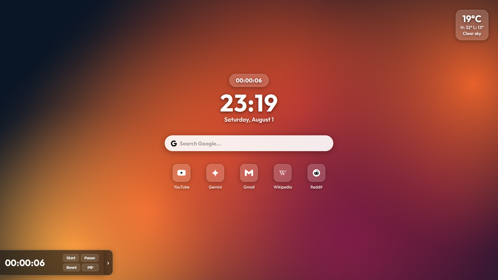

# Startpage — README

A custom browser start page / new tab page. Fully static — no build steps, no dependencies, no accounts required.



---

## 1. Getting Started

You can use this in two ways:

**A) Open it directly**
Just double-click `startpage.html` to open it in your browser whenever you want it.

**B) Set it as your homepage / new tab page**
So it loads automatically. How to do this varies by browser:

- **Chrome/Edge**: Settings → On Startup / New Tab, point it at the local file path of `startpage.html`.
- **Firefox**: Firefox does NOT allow local files as the native New Tab page. You'll need an extension such as "New Tab Override" to point it at a local file, or an `autoconfig.js` workaround.
- **Other browsers**: check their settings for "homepage" or "new tab page" and provide the file path to `startpage.html`.

This step differs enough between browsers/OS setups that it's outside the scope of this README — a quick search for `"[your browser] custom new tab local file"` will get you there.

---

## 2. Folder Structure

Keep this structure intact — the page expects it:

```
├── js/                    # all .js scripts (clock.js, weather.js, etc.)
├── svg/                   # all .svg icons used by quick links and widgets
├── startpage.html
├── startpage.css
├── wallpaper.jpg
└── outfit_variable.ttf
```

If you rename or move any of these folders, you'll need to update the matching paths in `startpage.html` and `startpage.css`. If you replace the quick links and their `.svg` icons, make sure the paths line up to where you saved the new icons.

---

## 3. Changing the Wallpaper

**Simplest method:** replace `wallpaper.jpg` with your own image, keeping the exact same filename.

**Alternatively:** use a different filename/format and update the reference in `startpage.css`, marked by the comment, in the `body`'s `background-image` rule.

---

## 4. Changing Quick Links

Quick links live in `startpage.html`. Each one looks like this:

```html
<a class="quicklink" href="https://www.website.com" title="Website" draggable="false">
  <div class="icon-square"></div>
  <span class="label">Website</span>
</a>
```

To customize:

| Attribute   | What it controls                                 |
|-------------|---------------------------------------------------|
| `href`      | The URL the link goes to                           |
| `title`     | Tooltip text on hover                               |
| `src`       | Path to the icon (see below)                        |
| `alt`       | Accessibility text, should match the site name      |
| label text  | The text shown under the icon                       |

You'll need to source your own icons — they are **not** included/generated for you. `.svg` is recommended since it's vector-based and scales cleanly at any size, but other image formats (`.png`, `.jpg`) will also work.

Place icon files in the `./svg/` folder to match the existing structure. When replacing the icons, make sure the filepath is correct — if they're in the `/svg/` folder, it will be `./svg/file.svg`.

---

## 5. Changing the Weather Location

Click the weather widget to open a popup where you can enter new coordinates (latitude, longitude), then refresh the page.

By default this repo ships with coordinates set to Paris, France as a neutral placeholder — change it to your own location the first time you use it. Alternatively, you can also change the default coordinates from Paris to another location by editing them in `weather.js`.

---

## 6. Changing the Clock Format (12h / 24h)

The clock format is hardcoded in `js/clock.js`. Open that file and look for wherever the time is formatted, and adjust the 12h/24h logic and AM/PM display there directly.

To switch from 24h to 12h with AM/PM, replace the hour line and the line that sets the `#clock` text with something like:

```javascript
let hours = now.getHours();
const ampm = hours >= 12 ? 'PM' : 'AM';
hours = hours % 12;
hours = hours ? hours : 12; // 0 should display as 12
const hh = String(hours).padStart(2, '0');
...
document.getElementById('clock').textContent = `${hh}:${mm} ${ampm}`;
```

No changes to `startpage.css` are required for this — the `#clock` style just sizes/colors whatever text is inside it.

> **Note:** Adding " AM"/" PM" makes the clock text wider than before, so it may look slightly off-center compared to the date/search bar under it once it's running. If that bugs you, the quickest fix is adding `text-align: center;` to the `#clock` rule in `startpage.css`, or just tweaking the `font-size` on `#clock` down a bit until it looks balanced again.

---

## 7. Font

This project uses **Outfit**, licensed under the SIL Open Font License (OFL). The font file (`outfit_variable.ttf`) is included in this repo and referenced via `@font-face` in `startpage.css` — don't delete or move it without also updating that reference.

See `OFL.txt` (if included) for the full font license text.

---

## 8. License

This project is licensed under the **MIT License** — see `LICENSE` for the full text. In short: you're free to use, modify, and distribute this however you like, including for personal or commercial purposes, with no warranty provided.

---

## 9. That's It

Everything else — colors, fonts, layout, spacing — lives in `startpage.css` and `startpage.html` and is fair game to edit directly. There's no build process or settings panel; you're editing the source files themselves. Have fun with it.

With Love,
Amadelphous
