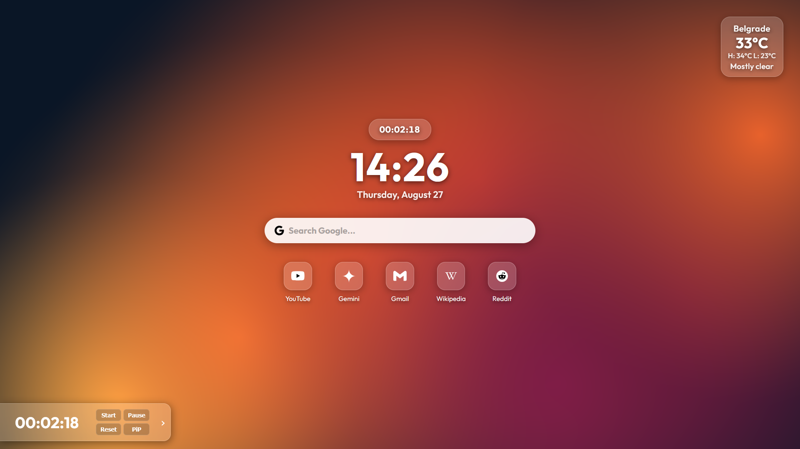
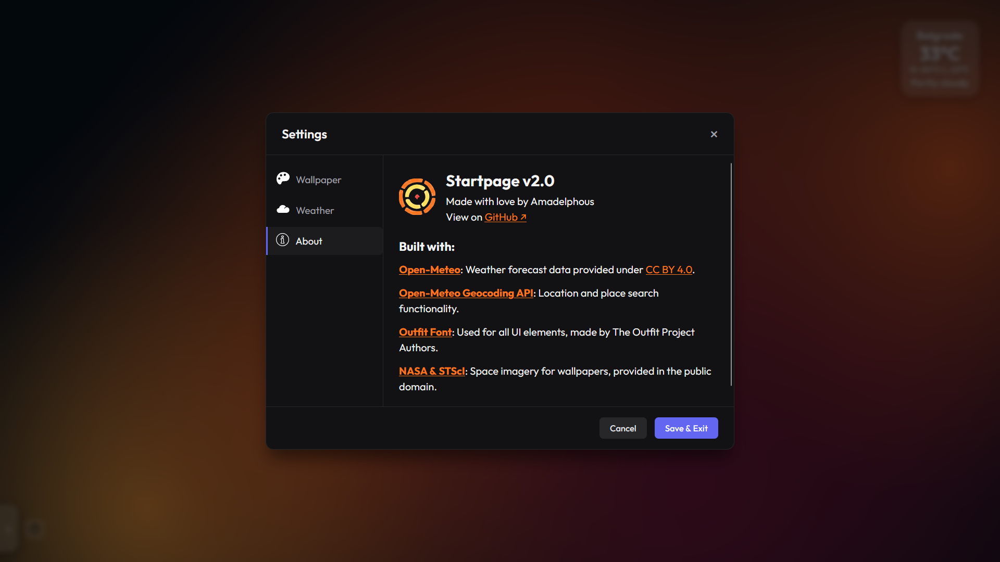
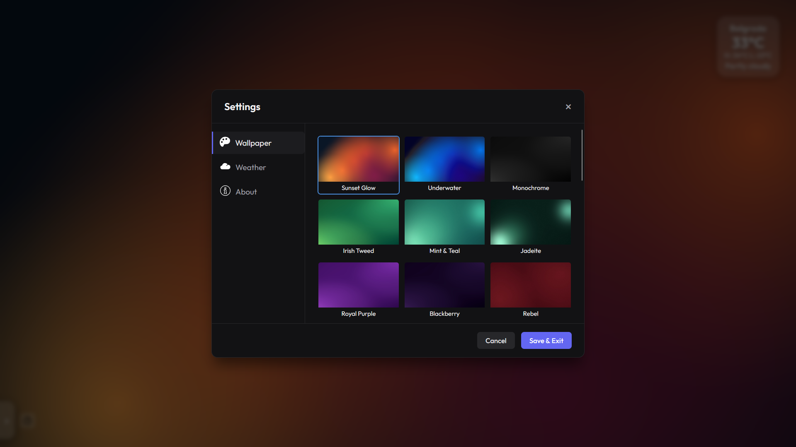
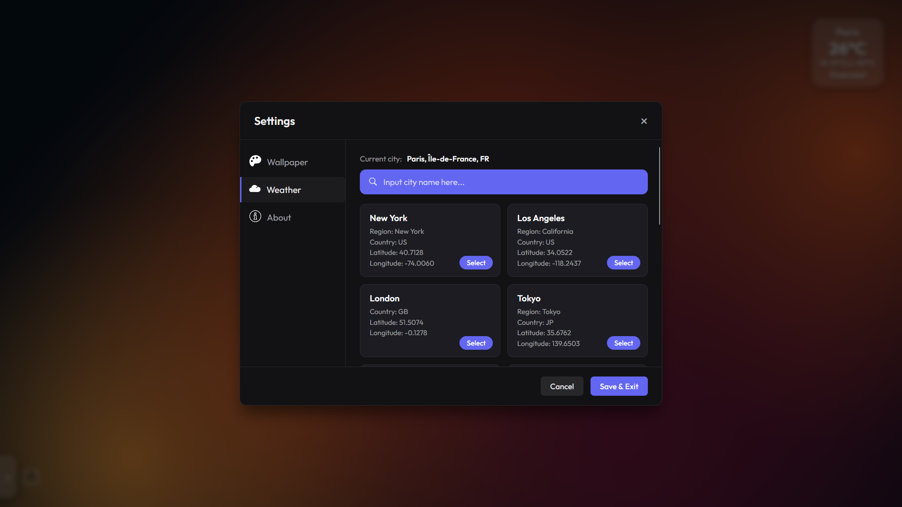

# Startpage

Startpage is a customizable browser start page and new-tab dashboard. It is a fully static project: there is no build step, package manager, backend, account, or installation process.

Check out the development on the [roadmap](./ROADMAP.md)!



## Features

- Live 24-hour clock and date display.
- Weather widget with current conditions and today's high/low temperatures.
- Searchable city selection powered by the Open-Meteo Geocoding API.
- Celsius and Fahrenheit temperature units.
- Optional city name shown above the weather widget.
- 30 bundled wallpapers, selectable from the Wallpaper tab.
- Quick links for frequently visited sites.
- Collapsible timer panel with stopwatch and countdown modes.
- Browser Picture-in-Picture timer display where supported.
- Settings saved in `localStorage`, so preferences persist in the browser.
- Responsive layout with no external JavaScript dependencies.

## Getting Started

1. Download or clone this repository.
2. Open `startpage.html` in a modern browser.
3. Use the settings gear in the lower-right corner to choose a wallpaper and weather location.

You can also host the folder with any static file server and use the resulting URL as your browser homepage. A local file works for the core interface, but an internet connection is required for live weather data and city search. Alternatively, you can use the [GitHub Pages](https://amadelphous.github.io/glassboard-homepage/) version!

To use Startpage as a new-tab page, browser support varies. Chrome and Edge generally require a new-tab extension, while Firefox can use an extension such as New Tab Override or tweaks via autoconfig.js in the app folder.

## Settings

Open the settings gear to access the unified settings modal:



### Wallpaper

Choose from the 30 wallpapers that come bundled with the Startpage! The selected image is applied immediately and remembered in the browser.



### Weather

Search for a city by name. Search results are fetched from the Open-Meteo Geocoding API after a short debounce, and selecting a result stores its coordinates locally. You can also change the temperature unit and choose whether the city name appears on the widget.

The default location is Paris, France. Weather data is refreshed when the page loads and every 15 minutes afterwards. The weather widget shows an error state if the API cannot be reached.



Changes made in the modal can be committed with **Save & Exit**. **Cancel**, the close button, Escape, and clicking the backdrop restore the values from before the modal was opened.

## Timer

Use the panel at the bottom of the page to run either a stopwatch or a countdown:

- Enter a duration as `HH:MM:SS`, or six digits such as `013000`.
- Select **Start**, **Pause**, or **Reset**.
- Use **PiP** to keep the timer visible in a separate browser window when the browser supports Picture-in-Picture.

Timer state is saved in `localStorage` and synchronized between tabs in the same browser profile.

## Customizing Quick Links

Quick links are defined in `startpage.html`. For now, there is no way to change them from within the page itself, only by editing the code. However, in-app changing of the quicklinks is planned for a later update.

## Project Structure

```text
startpage.html       Main page markup and settings modal
css/                 Component stylesheets
js/                  Clock, weather, timer, modal, wallpaper, and UI logic
svg/                 Icons used by the page
wallpapers/          Bundled wallpaper images
LICENSE              MIT License for the project
OFL.txt              SIL Open Font License for the Outfit font
```

Keep the relative paths and folder structure intact when moving the project.

## APIs and Credits

Weather forecasts come from the [Open-Meteo Weather API](https://open-meteo.com/) and city search uses the [Open-Meteo Geocoding API](https://open-meteo.com/en/docs/geocoding-api). Open-Meteo forecast data is provided under [CC BY 4.0](https://creativecommons.org/licenses/by/4.0/deed.en).

The interface uses the [Outfit font](https://fonts.google.com/specimen/Outfit), distributed under the SIL Open Font License. Wallpaper imagery includes public domain space imagery from [NASA and STScI](https://images.nasa.gov/). See `OFL.txt` for the bundled font license.

## License

The project code is available under the [MIT License](LICENSE). See the licenses and attribution above for bundled fonts, data, and imagery that have separate terms.

## Repository

View the project on [GitHub](https://github.com/amadelphous/glassboard-homepage).

With Love,
Amadelphous